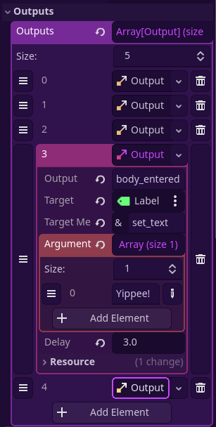

# Godot Triggers
An attempt to bring Source-like triggers and outputs in Godot, albeit in a limited state.

## Usage
1. Simply drag and drop the Trigger2D/Trigger3D into your scene and give it a CollisionShape2D/3D.
2. **IMPORTANT:** Set the collision mask of the trigger! Any areas/bodies in the layer it scans will activate the trigger. The collision layer of the trigger itself has no effect.
3. Add the outputs in the Inspector tab.

## The output system

The way outputs are handled are, as the description says, similar to how the Source engine handles outputs.
Here, `Output`s are `Resource`s that contain five variables. They ultimately just describe what method (and additional arguments) to call on a Node.

| Variable        | Type       |Description | Hammer equivalent |
| :-------------- | :--------- | :---------- | :---------------- |
| `output`        | String     | What causes this output to fire. Examples include `area_entered`, `area_exited`, etc. | My Output |
| `target`        | NodePath   | The node we are targeting. | Target Entity |
| `target_method` | StringName | The name of the method (function) we're calling to the target. | Target Input |
| `arguments`     | Array      | The arguments to be passed along when calling the target method. | Parameter |
| `delay`         | float      | The number of seconds to wait after the output event occurs before firing. | Delay |

Note that the Triggers have assertions for `output`, `target` and `target_method`.

By default, the Triggers only support four outputs:
- area/body_entered
- area/body_exited

You can, however, extend the trigger to add more outputs. 
### Adding custom outputs
In this section we will add the output "interacted" that will be fired when the player is in the trigger and presses the `ui_accept` button (spacebar).
1. Make a new array to store your custom outputs. (`_on_interacted_outputs)
2. Add `Output`s via the `_ready()` method.
```gdscript
func _ready() -> void:
	super._ready()
	
	for _output: Output in outputs:
		if _output.output == "interacted":
			_on_interacted_outputs.append(_output)
```
3. In your code for checking input and player collisions, add `_emit_outputs(_on_interacted_outputs)`.

## Adding outputs via code
This is mostly useful for when you're extending the Trigger script for more specific uses.
Here is a direct example from my game, which targets a specified "target location" Node, which has a method that essentially sets the player's global position to its global position.
```gdscript
func _ready() -> void:
	super._ready()
	
	var output: Output = Output.new()
	output.target = tele_target.get_path()
	output.target_method = "teleport"
	
	_on_area_entered_outputs.append(output)
```

## Known limitations
Source's outputs have refires. This one does not.
There are also no special targetnames unlike in Source, where you can call `!activator` to, I don't know, deal 10000 damage to the players that touch it during a Payload explosion or something. Wildcards are also a no-go (`setup_door_*` to call `setup_door_top` and `setup_door_bottom`). This is because the `target` in `Output`s require a NodePath, rather than a simple string name.
There are no ways to view all the outputs fired onto a Node, unlike Source.